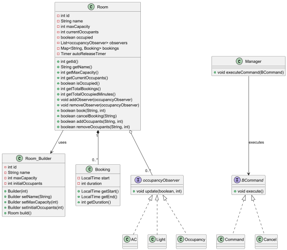

# Smart Office Management System

A console-based application to manage a smart office facility. The system handles **conference room bookings**, **occupancy detection**, and **automates control of air conditioning and lighting** based on room occupancy.

---

## Table of Contents
1. [Overview](#overview)
2. [Features](#features)
3. [Design Patterns & Principles](#design-patterns--principles)
4. [System Architecture](#system-architecture)

---

## Overview
The Smart Office Management System allows office administrators and employees to:  

- Configure the office with a specific number of meeting rooms.
- Book and cancel conference room reservations.
- Automatically detect occupancy based on the number of people in a room.
- Automate room devices (AC and lights) based on occupancy.
- Auto-release unoccupied bookings after a timeout period.

---

## Features

### Mandatory
- Configure number of rooms.
- Book and cancel conference room reservations.
- Detect occupancy using sensors (at least 2 people required).
- Auto-release unoccupied bookings after 5 minutes.
- Automatically turn off AC and lights when room is unoccupied.

### Optional
- Provide room usage statistics: total bookings and occupied minutes per room.

---

## Design Patterns & Principles

| Pattern | Usage |
|---------|-------|
| **Builder** | Used to create `Room` objects with flexible attributes (id, name, max capacity, initial occupants). |
| **Command** | Implements booking (`Command`) and cancellation (`Cancel`) operations via the `BCommand` interface. Decouples request execution from invoker. |
| **Observer** | `occupancyObserver` interface implemented by `AC`, `Light`, and `Occupancy` classes. Rooms notify observers of occupancy changes. |
| **Singleton** | `Config` class ensures a single instance manages all rooms. |
| **SOLID Principles** | Each class has a single responsibility. Open/Closed: new sensor types or commands can be added without modifying existing code. |

---

## System Architecture

### Class Diagram (PlantUML)

